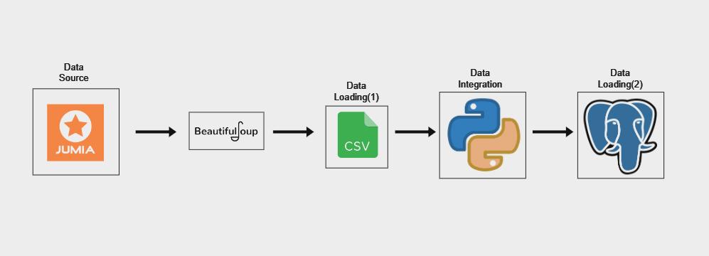

# Jumia Pipeline

This project involves scraping product data from Jumia using BeautifulSoup and Python, and then loading that data into a PostgreSQL database.

## Workflow

1. **Scrape Data:**
   - **File:** `scrapper.py`
   - **Description:** Uses BeautifulSoup to scrape product information from Jumia and saves the data to a CSV file.

```bash
   python scrapper.py
```

2. **Load Data into PostgreSQL:**

   - **File:** `csv2postgresql.py`
   - **Description:** Reads the CSV file created by the scraper and loads the data into a PostgreSQL database. Configuration settings are managed via an .ini file for easy customization.

```bash
python csv2postgresql.py
```

**For Configuration:**
- An **.ini**  file is provided for configuring the database connection and search parameters. Make sure to update it with your PostgreSQL connection details and any product search parameters you want to use.

**To Setup:**
Install Required Packages: Ensure you have all required Python packages installed. You can install them using:
```bash
pip install -r requirements.txt
```
##



